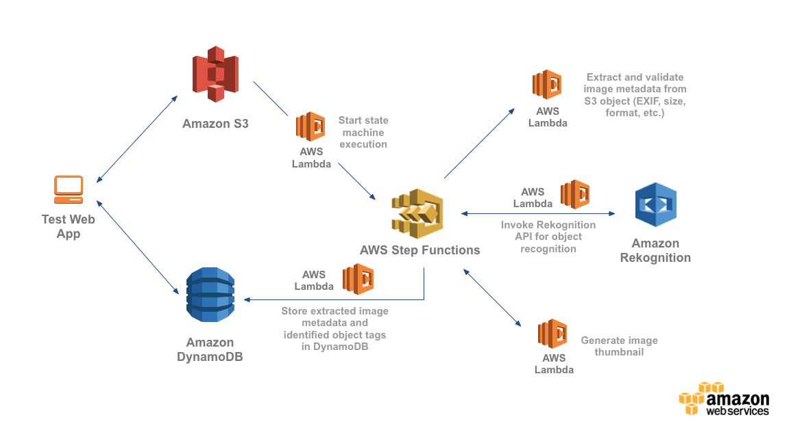

# AWSKRUG Data Analysis Hands-On #3 : Amazon Rekognition를 이용한 이미지 인식 태깅 서비스 만들기

이 핸즈온에서는 AWS Step Functions를 사용하여 서버 없이 이미지 인식 태깅 서비스를 단계별로 구축하는 방법을 배우게 됩니다.

아래 구성도에서 볼 수 있듯이 작업 흐름은 Amazon S3에 업로드된 사진을 처리하여 위치 정보, 크기/형식, 시간 등과 같은 메타 데이터를 이미지에서 추출합니다. 그런 다음 Amazon Rekognition을 사용하여 사진의 객체에 태그를 지정합니다. 동시에, 웹앱에서 사용할 섬네일 이미지를 생성합니다. AWS Step Functions는 다양한 단계를 조정하기 위해 오케스트레이션 역할을 합니다.

> 2018년 08월 09일부로 Amazon Rekognition 서울 리전에 출시하였습니다.:clap::clap: 이 [블로그](https://aws.amazon.com/ko/blogs/korea/amazon-rekognition-now-available-in-seoul-region/)에서 자세한 내용을 참고하세요. 

## 준비물

- AWS 계정에 대한 관리 액세스
- 자신 손에 익은 코드 편집기 (예 : WebStorm, Sublime Text 등)

## 지침

* [0 단계: 리소스 설정](step-0.md)
* [1 단계: AWS Step Functions 상태 머신 추가](step-1.md)
* [2 단계: 상태 머신에 분기 로직 추가](step-2.md)
* [3 단계: 워크 플로우에 병렬 처리 추가](step-3.md)
* [4 단계: 레이블 및 이미지 메타 데이터 유지](step-4.md)
* [5 단계: S3 이벤트 실행 시작](step-5.md)
* [6 단계: 웹 응용 프로그램 빌드 및 실행](step-6.md)
* [리소스 정리](clean-up.md)
